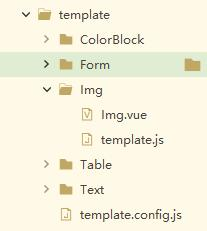

# 超级编辑器开发流程

## 主要目录介绍
```
pages目录： eidt 编辑页面， preview预览页面
template目录： 所有组件目录
components目录：  公共头，侧边栏，内容区，编辑区代码在该目录下
```

## 添加组件目录命名规范 
```
1. 组件独立目录
2. 组件目录首字母大写
3. 组件vue文件首字母大写
4. 如果组件有子组件，在该组件目录下新建components，放入该目录中
5. 对于可放置组件，名字带上Container ，比如 TabsContainer
```


## 添加组件流程
```
可以先参考最简单的组件Img
1.去template目录下，按照规范新建目录和文件
2.添加template.js（固定命名）,定义你的组件字段
3.定义默认字段初始值
	x: "0",
	y: "0",
	width: "200",
	height: "",
	zIndex:2
  是公共必须建立的, 业务组件zIndex默认是2,装饰组件默认是1,其他参数根据你的组件自由设置值
 4. 去template.config.js中注册你的组件
```

```
<!-- template.config.js 文件 -->
import Form from "./Form/template.js";
import Table from "./Table/template.js";
import Img from "./Img/template.js";
import Text from "./Text/template.js";
import ColorBlock from "./ColorBlock/template.js";
export default {
	Form,
	Table,
	Img,
	Text,
	ColorBlock
}
注意命名，和定义的目录，组件名称要统一，否则加载不到，也不方便维护
到这里组件已经添加完成
```

```
5. 将你添加的组件，在左侧菜单栏显示出来，加一个菜单，去 EditControl.vue 下添加{id:"你的组件名"，name："自定义显示在菜单的名字"}
注意命名，id后面面的值要和你的组件目录名完全一致才能加载

businessList:[//业务组件
	{
		id:"Form",
		name:"表单",
	},
	{
		id:"Table",
		name:"表格",
	},
	{
		id:"Img",
		name:"图片",
	},
	{
		id:"Text",
		name:"文本",
	}
],
styleList:[//装饰组件
	{
		id:"ColorBlock",
		name:"背景框"
	}
],

到这里组件添加完整流程结束
```

## 组件内容固定格式
```
先参考 Img组件

1.
:draggable="isEdit"
@drag.stop="drag($event)"
@dragstart.stop="dragStart($event,currentTemplateDate)"
@click.stop="showEdit"
:style="{...styleObject}"

2.
props: ["currentTemplateDate", "templateName", "styleObject"],

组件上绑定属性和事件即可，其他自定义，正常开发
```

## 组件编辑区配置
```
配置文件可参考：ImgConfig.vue
1. 每个组件的独立配置都是一个新文件
2. 文件放在 EditControl目录下， 文件名是 当前组件名 + Config, 注意命名规范
3. 在EditControl.vue 中 引入你的组件编辑
```

## 所有组件公共属性配置添加
```
1.preview.vue 文件里， 写在styleObject中。
2.配置项 写在 CommonConfig.vue 中。
```

